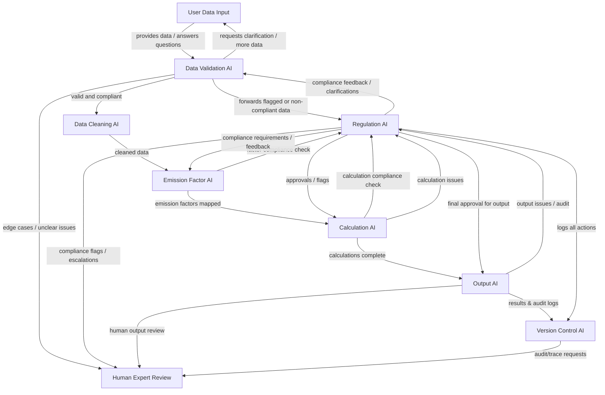

## End-to-End Agentic CO₂ Accounting AI – Architecture Overview

This architecture models a modular, agent-based workflow for automated CO₂ accounting, designed for scalable, standards-compliant emissions calculations. Every major AI component interacts closely with others, and humans remain in the loop for expert review and oversight.

**Workflow and Interactions**

- **User Data Input ↔ Data Validation AI:**  
  Users submit emissions data. Data Validation AI may request clarifications or further data from users before validation proceeds.

- **Data Validation AI ↔ Regulation AI:**  
  If the Data Validation AI detects non-compliance or ambiguity, it forwards data to Regulation AI. Regulation AI reviews, provides feedback or clarification, and may send data back for re-validation.

- **Data Validation AI → Data Cleaning AI:**  
  Once validated and compliant, data is sent for standardization and correction.

- **Data Cleaning AI → Emission Factor AI:**  
  Cleaned data is provided to Emission Factor AI for assignment of correct emission factors.

- **Emission Factor AI ↔ Regulation AI:**  
  Emission Factor AI checks assignments with Regulation AI, which can approve, request changes, or give feedback for compliance.

- **Emission Factor AI → Calculation AI:**  
  With approved emission factors, data moves to Calculation AI.

- **Calculation AI ↔ Regulation AI:**  
  Calculation AI validates all results with Regulation AI, which can approve, flag, or require corrections to calculations.

- **Calculation AI → Output AI:**  
  Once calculations pass compliance, data proceeds to Output AI.

- **Regulation AI → Output AI:**  
  Regulation AI gives the final approval before output generation.

- **Output AI → Version Control AI:**  
  Output AI logs all outputs and reports to Version Control AI for traceability and auditing.

- **Regulation AI → Version Control AI:**  
  Regulation AI logs all decisions, feedback, and compliance actions for a complete audit trail.

- **Escalation to Human Expert Review:**  
  At any point, any AI can escalate unclear, non-compliant, or ambiguous cases to a human expert for resolution.

**Key Principles**
- **Modularity:** Each AI module handles a specific function, making the system flexible and easy to extend.
- **Comprehensive Logging:** All actions and decisions are tracked by Version Control AI for transparency and auditability.
- **Human-in-the-Loop:** Ambiguous or difficult cases are always routed to human experts.
- **Compliance Focus:** Regulation AI ensures every result meets GHG Protocol, LSRG, and SBTi requirements.
- **Rich Interactions:** Every key check and feedback loop is shown in the diagram for transparency.

See the diagram below for a detailed map of all module interactions.

