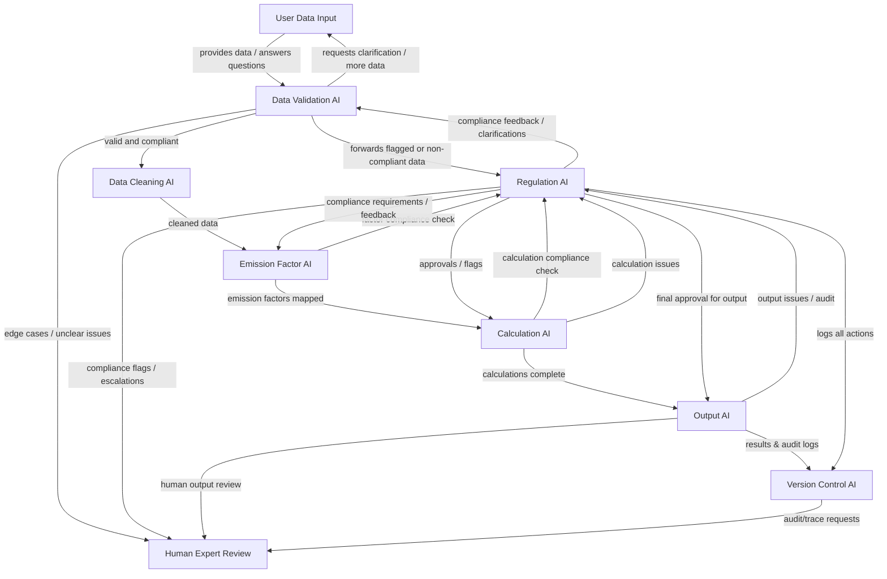

```mermaid
flowchart TD
    A[User Data Input]
    B[Data Validation AI]
    C[Regulation AI]
    D[Data Cleaning AI]
    E[Emission Factor AI]
    I[Calculation AI]
    F[Output AI]
    G[Version Control AI]
    H[Human Expert Review]

    %% User and Data Validation exchange
    A -- provides data / answers questions --> B
    B -- requests clarification / more data --> A

    %% Data Validation and Regulation AI exchange
    B -- forwards flagged or non-compliant data --> C
    C -- compliance feedback / clarifications --> B

    %% Main process flow
    B -- valid and compliant --> D
    D -- cleaned data --> E
    E -- emission factors mapped --> I
    I -- calculations complete --> F
    F -- results & audit logs --> G

    %% Emission Factor AI and Regulation AI tandem interaction
    E -- factor compliance check --> C
    C -- compliance requirements / feedback --> E

    %% Calculation AI and Regulation AI tandem interaction
    I -- calculation compliance check --> C
    C -- approvals / flags --> I

    %% Regulation AI approvals and output
    C -- final approval for output --> F
    C -- logs all actions --> G

    %% Human in the loop and issue escalation
    B -- edge cases / unclear issues --> H
    C -- compliance flags / escalations --> H
    I -- calculation issues --> C
    F -- output issues / audit --> C
    F -- human output review --> H
    G -- audit/trace requests --> H
```
