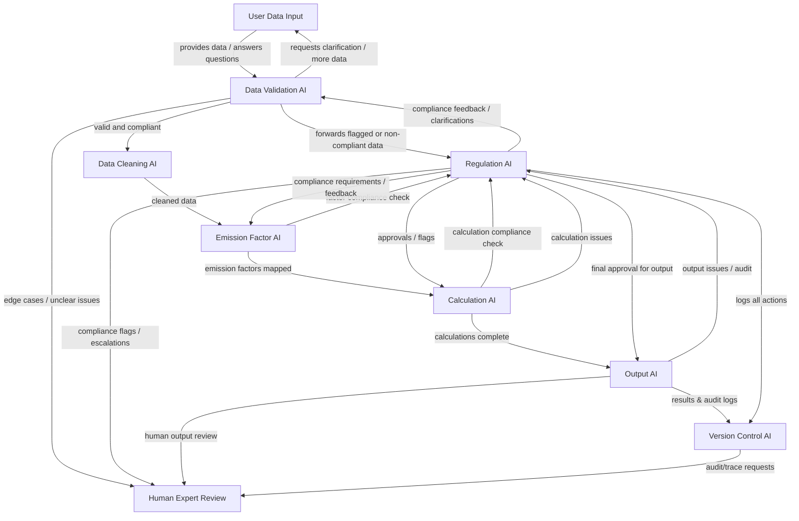

## End-to-End Agentic CO₂ Accounting AI – Architecture Overview

Modern CO₂ accounting is complex, blending regulatory requirements, data from many sources, and the need for both automation and human oversight. This repository presents a modular, agent-based AI framework designed to handle these challenges at scale. The architecture is captured in the chart below, mapping out how each specialized AI module interacts—from first data input to final output—while ensuring that every step remains transparent, auditable, and aligned with standards like the GHG Protocol, LSRG, and SBTi.

At a high level, the system guides user data through a series of collaborative modules: data is validated, cleaned, matched with emission factors, and calculated for emissions—all under continuous compliance review. Regulation AI is woven throughout, acting as a constant checkpoint, while Version Control AI keeps a full audit trail and any uncertainties are sent to human experts. This flow not only delivers reliable results but also keeps humans in the loop, ready to address unique or ambiguous cases.  

Below, each module is described in detail so you can understand the workflow and every key interaction in this end-to-end agentic CO₂ accounting system.

**User Data Input**  
The journey begins with the User Data Input module, where users supply all the information necessary for CO₂ accounting. This isn’t a one-way street—if something is unclear, the Data Validation AI can request clarification or more details. The user is guided, step by step, to ensure that the data provided is as complete and accurate as possible before it ever enters the automated pipeline.

**Data Validation AI**  
Once the initial data is received, the Data Validation AI takes the lead in checking for completeness, correctness, and regulatory relevance. This engine doesn’t work in isolation: when it spots ambiguous or potentially non-compliant entries, it reaches back to the user for more context and consults the Regulation AI for compliance checks. This two-way dialog with both users and Regulation AI forms a critical filter, ensuring only well-vetted information moves forward.

**Regulation AI**  
The Regulation AI serves as the system’s compliance guardian. As soon as it receives data or requests from Data Validation AI, or later from Emission Factor or Calculation AI, it reviews the material against the latest standards and rules (like GHG Protocol, LSRG, and SBTi). Its feedback and approvals are essential; it may request changes, flag issues, or give the green light, maintaining active two-way interactions across the architecture to uphold regulatory alignment at every stage.

**Data Cleaning AI**  
Clean, consistent data is the backbone of reliable calculations. The Data Cleaning AI picks up validated data and transforms it—fixing formats, standardizing values, and correcting any remaining errors. By delivering high-quality data to the next step, it reduces errors downstream and increases confidence in every result.

**Emission Factor AI**  
Emission Factor AI is where scientific rigor meets context. For each record, it determines the appropriate emission factor, factoring in details like geography, sector, or activity type. It doesn’t do this alone; every assignment is checked by Regulation AI, which can suggest changes or confirm compliance. This ensures every factor applied is defendable and audit-ready.

**Calculation AI**  
With all inputs prepared, Calculation AI performs the actual emissions computations. It’s tightly linked to Regulation AI, checking every calculation for compliance and accuracy. If issues arise—like unexpected results or regulatory mismatches—the module doesn’t proceed silently. It sends results back for further review, or waits for approval, so only solid, compliant outputs continue.

**Output AI**  
The Output AI takes validated calculations and compiles them into final deliverables: spreadsheets, reports, or digital records that embed all relevant data, formulas, and emission factors. But it never operates alone. Before publishing, it waits for final approval from Regulation AI, ensuring nothing non-compliant leaves the system. All outputs are then logged for full traceability.

**Version Control AI**  
Every action, decision, and result from the main modules is meticulously recorded by Version Control AI. This creates a living audit trail, allowing any result to be traced back through every step, change, and approval. It’s the system’s memory, supporting transparency, troubleshooting, and regulatory audits.

**Human Expert Review**  
Finally, whenever an AI encounters an edge case, ambiguous issue, or compliance question it can’t resolve, it hands the matter over to Human Expert Review. This ensures that difficult or unique scenarios always get thoughtful, expert attention—making the system scalable but never out of human hands.

Together, these modules create a robust, transparent, and collaborative workflow for end-to-end CO₂ accounting, where every interaction is clear, every decision traceable, and human judgment always plays a crucial role.

