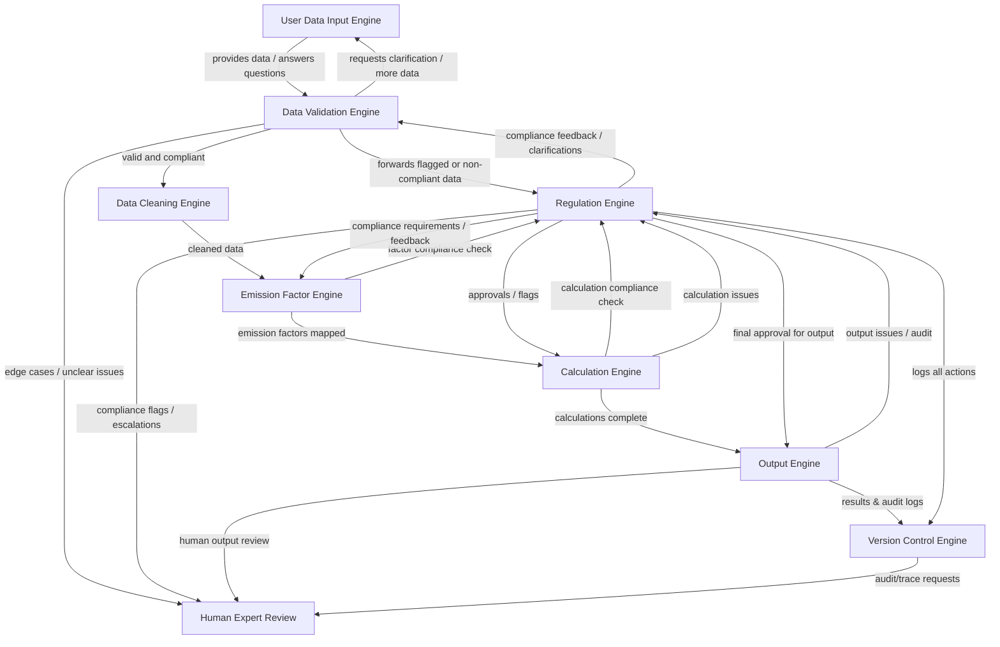

# End-to-End Agentic CO₂ Accounting AI – Architecture Overview

This repository presents a modular, agent-based AI framework designed to handle GHG accounting challenges at scale. The architecture maps out how each specialized **Engine** interacts—from first data input to final output—while ensuring that every step remains transparent, auditable, and aligned with standards like the [GHG Protocol](https://ghgprotocol.org), [LSRG](https://lsrg.io), and [SBTi](https://sciencebasedtargets.org).

At a high level, the system guides user data through a series of collaborative modules: data is validated, cleaned, matched with emission factors, and calculated for emissions—all under continuous compliance review. **Regulation Engine** is woven throughout, acting as a constant checkpoint, while **Version Control Engine** keeps a full audit trail and any uncertainties are sent to human experts. This flow not only delivers reliable results but also keeps humans in the loop, ready to address unique or ambiguous cases.

Below, each module is described in detail so you can understand the workflow and every key interaction in this end-to-end agentic CO₂ accounting system.

---

## User Data Input Engine

The journey begins with the User Data Input Engine, where users supply all the information necessary for CO₂ accounting. This isn’t a one-way street—if something is unclear, the Data Validation Engine can request clarification or more details. The user is guided, step by step, to ensure that the data provided is as complete and accurate as possible before it ever enters the automated pipeline.

## Data Validation Engine

Once the initial data is received, the Data Validation Engine takes the lead in checking for completeness, correctness, and regulatory relevance. This engine doesn’t work in isolation: when it spots ambiguous or potentially non-compliant entries, it reaches back to the user for more context and consults the Regulation Engine for compliance checks. This two-way dialog with both users and Regulation Engine forms a critical filter, ensuring only well-vetted information moves forward.

## Regulation Engine

The Regulation Engine serves as the system’s compliance guardian. As soon as it receives data or requests from Data Validation Engine, or later from Emission Factor or Calculation Engine, it reviews the material against the latest standards and rules (like GHG Protocol, LSRG, and SBTi). Its feedback and approvals are essential; it may request changes, flag issues, or give the green light, maintaining active two-way interactions across the architecture to uphold regulatory alignment at every stage.

## Data Cleaning Engine

Clean, consistent data is the backbone of reliable calculations. The Data Cleaning Engine picks up validated data and transforms it—fixing formats, standardizing values, and correcting any remaining errors. By delivering high-quality data to the next step, it reduces errors downstream and increases confidence in every result.

## Emission Factor Engine

Emission Factor Engine is where scientific rigor meets context. For each record, it determines the appropriate emission factor, factoring in details like geography, sector, or activity type. It doesn’t do this alone; every assignment is checked by Regulation Engine, which can suggest changes or confirm compliance. This ensures every factor applied is defendable and audit-ready.

## Calculation Engine

With all inputs prepared, Calculation Engine performs the actual emissions computations. It’s tightly linked to Regulation Engine, checking every calculation for compliance and accuracy. If issues arise—like unexpected results or regulatory mismatches—the module doesn’t proceed silently. It sends results back for further review, or waits for approval, so only solid, compliant outputs continue.

## Output Engine

The Output Engine takes validated calculations and compiles them into final deliverables: spreadsheets, reports, or digital records that embed all relevant data, formulas, and emission factors. But it never operates alone. Before publishing, it waits for final approval from Regulation Engine, ensuring nothing non-compliant leaves the system. All outputs are then logged for full traceability.

## Version Control Engine

Every action, decision, and result from the main modules is meticulously recorded by Version Control Engine. This creates a living audit trail, allowing any result to be traced back through every step, change, and approval. It’s the system’s memory, supporting transparency, troubleshooting, and regulatory audits.

## Human Expert Review

Finally, whenever an Engine encounters an edge case, ambiguous issue, or compliance question it can’t resolve, it hands the matter over to Human Expert Review. This ensures that difficult or unique scenarios always get thoughtful, expert attention—making the system scalable but never out of human hands.

---

To orchestrate this agentic CO₂ accounting architecture, use **Ray** as the core framework. Ray enables you to define each Engine as an independent actor (agent), manage communication between them, and coordinate their workflows in parallel or in groups. Use **FastAPI** to expose each module as a service when external access or modular deployment is needed. For shared data, logging, and traceability, rely on **PostgreSQL** as a backend database. Integrate **Prometheus** and **Grafana** for system monitoring and performance dashboards. For human-in-the-loop reviews, build a custom dashboard with **Streamlit** that lets experts view and approve flagged cases in real time.

This combination allows you to manage groups of agents, maintain transparency, and ensure every decision is tracked and auditable.

Together, these modules create a robust, transparent, and collaborative workflow for end-to-end CO₂ accounting, where every interaction is clear, every decision traceable, and human judgment always plays a crucial role.

---

**References:**  
- [GHG Protocol](https://ghgprotocol.org)  
- [SBTi](https://sciencebasedtargets.org)  
- [LSRG](https://lsrg.io)  
- [Ray by Anyscale](https://www.anyscale.com/ray)  
- [FastAPI](https://fastapi.tiangolo.com)  
- [PostgreSQL](https://www.postgresql.org)  
- [Prometheus](https://prometheus.io)  
- [Grafana](https://grafana.com)  
- [Streamlit](https://streamlit.io)

---

*For feedback or contributions, please open an issue or pull request!*

